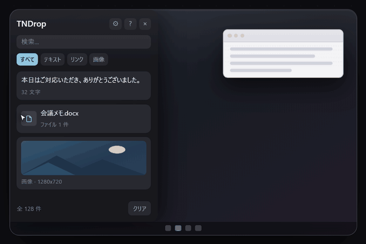
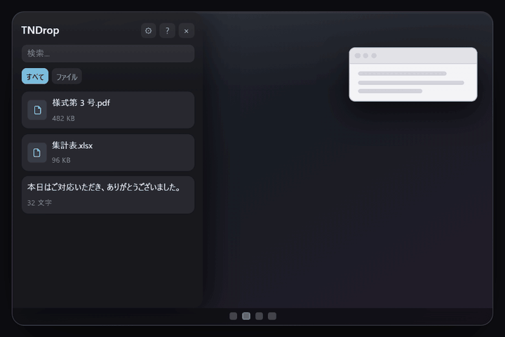
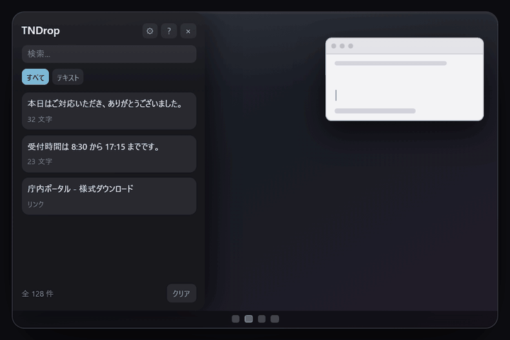

# TNDrop

Windows 用のクリップボードシェルフ常駐アプリ。画面端にカーソルを寄せると棚が現れ、コピーした内容を自動でストックする (Microsoft Edge の Drop 機能に近い体験を目指したもの)。



## 主な機能

- **棚 (シェルフ)**: 画面端にカーソルを寄せると開くトレイ常駐の一時置き場
- **自動ストック**: テキスト・画像・ファイルのコピーを自動的にカードとして保存
- **ドラッグ&ドロップ**: 棚へのドラッグインと、棚からアプリへのドラッグアウトの両方に対応
- **グループ化**: 複数カードをスタックにまとめて整理・展開
- **ピン留め**: よく使うカードを固定し、自動削除の対象から外す
- **検索・フィルター**: 種類 (テキスト/画像/ファイル) やキーワードで絞り込み
- **スクリーンショット取り込み**: 画面キャプチャをそのままカード化
- **クリックで貼り付け**: カードをクリックするだけでコピー扱いにできる





## 動作環境

- Windows 10 / 11 (x64)
- .NET ランタイム同梱 (self-contained) のため、別途 .NET のインストール不要
- 管理者権限不要 (ユーザー単位インストール)

## インストール

[Releases](../../releases) から最新の `TNDrop-Setup-x.y.z.exe` をダウンロードして実行してください。インストーラーは管理者権限を要求しません。

## オフライン・データについて

TNDrop は完全にオフラインで動作します。外部通信・テレメトリの送信は一切行いません。

- 保存先: `%APPDATA%\TNDrop\`
- 履歴データ (`items.dat`) は Windows DPAPI (現在のユーザーアカウント紐付け) で暗号化して保存
- 画像は `blobs\` フォルダーに保存
- アンインストール時、`%APPDATA%\TNDrop\` の履歴データは削除されません (再インストール時に復元されます)

## ビルド方法

.NET SDK (net10.0-windows 対応版) と Inno Setup 7 がインストールされた Windows 環境で:

```powershell
.\build.ps1
```

テスト実行 → `dotnet publish` (self-contained / win-x64) → Inno Setup によるインストーラー生成までを一括で行い、`dist\TNDrop-Setup-x.y.z.exe` を出力します。

## ライセンス

MIT License。詳細は [LICENSE](LICENSE) を参照してください。

同梱している .NET ランタイムおよび依存パッケージのライセンス表記は [THIRD-PARTY-NOTICES.txt](THIRD-PARTY-NOTICES.txt) にまとめています。

なお、アプリ内には視覚的な使い方ガイド (README.html) が同梱されており、シェルフ右上の「?」ボタンからいつでも開けます。
